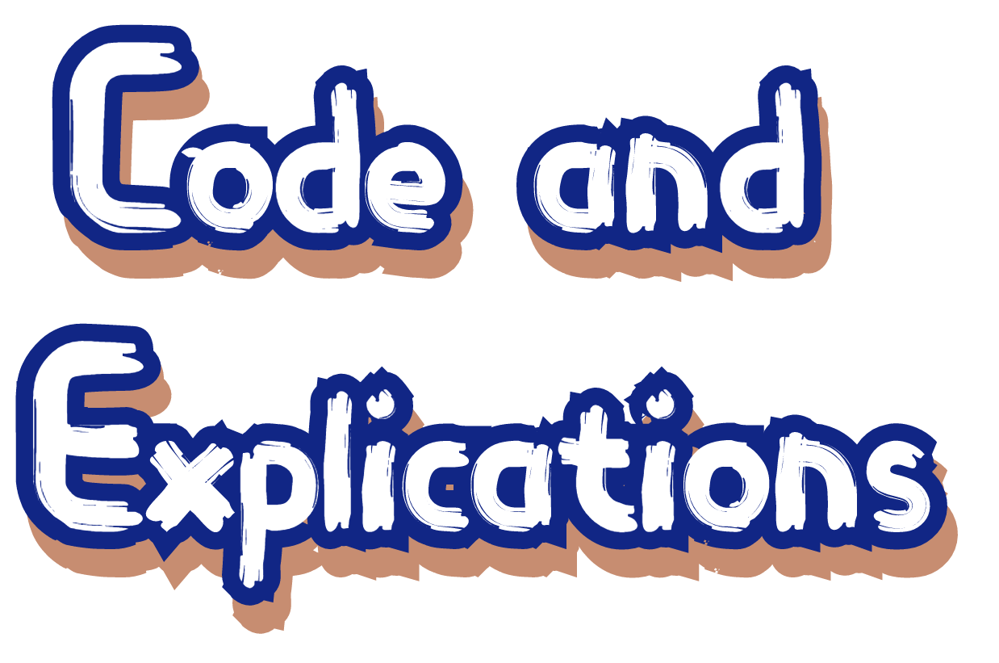
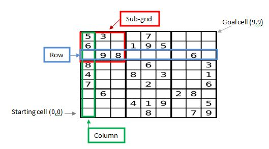
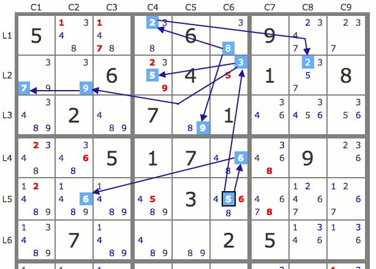
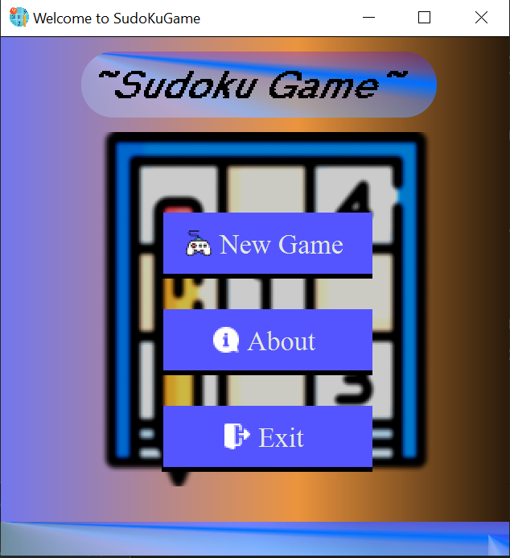
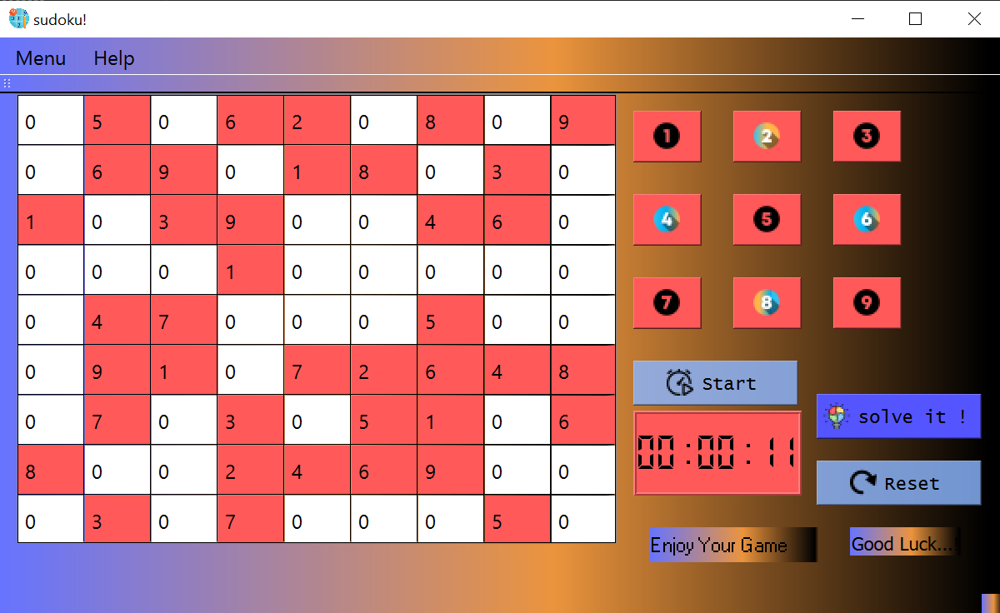

  * * * * 


## * **Introduction**
## * **Code and Explications** 
## * **Conclusion** 
<br>


<br>

<br>
<br>

# Introduction

<p style="font-size:20px" > Sudoku is a number-placement puzzle widely popular in the world, credited with helping to keep the brain active and healthy.
The basis of the game originated in Switzerland in the 18th century when the mathematician Leonhard Euler developed the concept of Latin Squares used in statistical analysis. The modern Sudoku as we know it nowadays, however, using digits instead of the Latin alphabet, was most likely the creation of Howard Garns, an architect from Indiana who first published his version of the game in the Dell Magazines in **1979**. So what we wait !! let's start coding ...</p> 

<br>
<br>



<br>
<br>
<br>
<br>


<br>
<br>
<br>
<br>
<br>
<br>

<p style="font-size:20px" >Before we start coding and creating classes we need first of all understand the architecture of a Sudoku game that is in form of Grid of 9x9 and coding by a for loop and matrixes that implicit the work and not have redundancy </p>

<br>



<br>
<br>

<p style="font-size:20px" >Sudoku is a number logic game where the goal is to fill a square grid with numbers
relating to the size of the puzzle. The typical Sudoku puzzle is a nine by nine grid
that must be filled using the numbers one through nine. The grid is divided into rows,
columns, and subsquares. A subsquare is an n by n square, where n is the square
root of the number of columns or rows. For a standard Sudoku puzzle, n is three. All
standard Sudoku puzzle will be already partially filled in. The
information provided by these preexisting numbers determines the general difficulty
level of the puzzle. The goal is to arrange numbers on the grid so that every number
appears only once in each row, column, and subsquare</p>


<br>



<br>

<p style="font-size:18px " align=""  >In our case we have blocks insted of and each block contain 3x3 grid, so i design a small figure to show you 
  </p>

<p style="font-size:20px " align=""  >To make our code easy to understand , i will split the totality of the code into two part :
  
  * Part 1 : For the main functionnality of the Sudoku game
   
   * Part 2 : For the interface of our game 
  </p>
<br>

# *Part 1*

<p style="font-size:18px " align="center"  >For the first part we will create two classes plus a header class that will help the two classes 
<br>Firt class called  << matrix >> <br> The main functionnality of the class present the heart of the game where we can find the for loop that will create the matrixes and another elements :
  </p>
<br>

# Matrix.h
<br>

```c++
#ifndef _MATRIX
	#include "rdarray.h"
	
	#define _MATRIX
#endif

namespace sudoku{
	class matrix{
		public:
        bool you_win();//a bollean method stand for the win case
        void write(int i, int j, int val);
        void new_puzzle();//used to put new puzzle
        void solve();//to solve the puzzle
        void reset();//to reset the puzzle
        void empty();//if it empty or not
		int read(int i, int j);
        int output(int (*mat)[9]);
        int input(int (*mat)[9]);
        matrix(int (*mat)[9]);
        matrix();

		private:
        int obj[9][9];
        int row[9];
        int col[9];
        int block[4][4];
        int ne[9][9];
		sudoku::rdarray ra;
		int dfs(int ni, int nj);

		void init();
	};
}

```
<p style="font-size:18px " align="center"  >And we can find the implementation of the methods in the :
</p>
<br>

# Matrix.cc
<br>

```c++
#include "matrix.h"
//to initialize the matrixes by dividing them to 3 blocks
void sudoku::matrix::init()
{
	for (int i = 0; i < 9; ++i)
	{
		this->row[i] = this->col[i] = 0;
		this->block[i/3][i%3] = 0;
	}
    //browse the matrixes and initialize the positions that are not defined by 0
	for (int i = 0; i < 9; ++i)
	{
		for (int j = 0; j < 9; ++j)
		{
			if(this->obj[i][j])
			{
				int sig = (1 << (obj[i][j] - 1));
				this->row[i] |= sig;
				this->col[j] |= sig;
				this->block[i/3][j/3] |= sig;
				this->ne[i][j] = 1;
			}
			else this->ne[i][j] = 0;
		}
	}
}
//to pass throught all the matrixes with two loop for and to make easy the coherence of code
int sudoku::matrix::input(int (*mat)[9])
{
	for (int i = 0; i < 9; ++i)
	{
		for (int j = 0; j < 9; ++j)
		{
			this->obj[i][j] = mat[i][j];
		}
	}
    return 1;
}

sudoku::matrix::matrix(int (*mat)[9]):ra()
{
	input(mat);
}

sudoku::matrix::matrix()
{
 /*   for (int i = 0; i < 9; ++i)
    {
        this->row[i] = this->col[i] = 0;
        this->block[i/3][i%3] = 0;
    }

    for (int i = 0; i < 9; ++i)
    {
        for (int j = 0; j < 9; ++j)
        {
            this->obj[i][j] = 0;
        }
    }*/
}

int sudoku::matrix::dfs(int ni, int nj)
{
	// std::cout << '(' << ni << ',' << nj << ')' << std::endl;
	if (this->obj[ni][nj])
	{
        //the condition that the numbers in the matrixes should be less than 9
		if (nj+1 < 9)
			return dfs(ni, nj+1);
		else if (ni+1 < 9)
			return dfs(ni+1, 0);
		else
			return 1;
	}
	else
	{
		int sig = this->row[ni] | this->col[nj] | this->block[ni/3][nj/3];
		// std::cout << sig << std::endl;
		this->ra.narray();
        //browse all the matrixes and check that the numbers are not passs number 9 and not repeated
        //in the colomn or in the row or in the block
		for (int i = 0; i < 9; ++i)
		{
			int ri = this->ra.read(i);
			int sign = (1<<(ri-1));
			// std::cout << i;
			if (!(sig & sign))
			{
				// std::cout << std::endl << i << std::endl;
				this->obj[ni][nj] = ri;
				this->row[ni] |= sign;
				this->col[nj] |= sign;
				this->block[ni/3][nj/3] |= sign;
				if (nj+1 < 9)
				{
					if (dfs(ni, nj+1) > 0)
						return 1;
				}
				else if (ni+1 < 9)
				{
					if (dfs(ni+1, 0) > 0)
						return 1;
				}
				else
				{
					return 1;
				}
				this->obj[ni][nj] = 0;
				this->row[ni] ^= sign;
				this->col[nj] ^= sign;
				this->block[ni/3][nj/3] ^= sign;
			}
		}
		return -1;
	}
}
//if the conditions of repeated and less than number 9 are correct solve the matrix
void sudoku::matrix::solve()
{
    init();
	dfs(0, 0);
}

int sudoku::matrix::output(int (*mat)[9])
{
	int res = 1;
	for (int i = 0; i < 9; ++i)
	{
		for (int j = 0; j < 9; ++j)
		{
			mat[i][j] = this->obj[i][j];
			res = res && mat[i][j];
		}
	}
	return res;
}
//assign the value to the position that is defined by
void sudoku::matrix::write(int i, int j, int val)
{
	if (ne[i][j])
		return;
	this->obj[i][j] = val;
}
//the value of number that located on the i and j positions
int sudoku::matrix::read(int i, int j)
{
	return this->obj[i][j];
}
//Initialiaizes grid with empty values
void sudoku::matrix::empty()
{
    /*for (int i = 0; i < 9; ++i)
    {
        this->row[i] = this->col[i] = 0;
        this->block[i/3][i%3] = 0;
    }

    for (int i = 0; i < 9; ++i)
    {
        for (int j = 0; j < 9; ++j)
        {
            this->obj[i][j] = 0;
        }
    }*/
}


bool sudoku::matrix::you_win()
{
	for (int i = 0; i < 9; ++i)
	{
		row[i] = 0;
		col[i] = 0;
		block[i/3][i%3] = 0;
	}
    //browse the matrixes by the for loops and check that the conditions are correct
	for (int i = 0; i < 9; ++i)
	{
		for (int j = 0; j < 9; ++j)
		{
			int sig = row[i] | col[j] | block[i/3][j/3];
			int sgn = (1 << (obj[i][j] - 1));
			if (!(sig&sgn))
			{
				row[i] |= sgn;
				col[j] |= sgn;
				block[i/3][j/3] |= sgn;
			}
			else
			{
				return false;
			}
		}
	}
	return true;
}
//to set a new puzzle
void sudoku::matrix::new_puzzle()
{
    //empty();
    solve();
	srand(time(NULL));
    //Generates random numbers to sudoku game
    int rdbox = rand()%10 + 40;
	for (int k = 0; k < rdbox; ++k)
	{
		int i = rand()%9;
		int j = rand()%9;
		while(!obj[i][j])
		{
            //Resets the row with random values from 1 to 9
			i = rand()%9;
			j = rand()%9;
		}
		obj[i][j] = 0;
	}
    init();
}
//reset the matrix by giving a 0 to all numbers except the numbers that already defined
void sudoku::matrix::reset()
{
    for (int i = 0; i < 9; ++i)
    {
        for (int j = 0; j < 9; ++j)
        {
            if (!ne[i][j])
                obj[i][j] = 0;
        }
    }
}

```
<br>
<p style="color:red; font-size:18px  " align="center"  >NB: There is no difference between the .cpp file and the .cc just the last is from the UNIX culture but is the same 
</p>

<br>
<p style="font-size:18px " align="center"  >
Second class called  << rdarray >> <br> contains some elements that help the game to have a random values by creating some arrays :
  </p>
<br>

# Rdarray.h
<br>

```c++
#ifndef _RDARRAY
	#include <cstdlib>
	#include <time.h>
	#define _RDARRAY
#endif

namespace sudoku{
	class rdarray{
		public:
			rdarray();
			void narray();
			int read(int i);

		private:
            int array[9];
			int rdseed;
	};
}

```
<p style="font-size:18px " align="center"  >And we can find the implementation of the methods in the :
</p>
<br>

# Rdarray.cc
<br>

```c++
#include "rdarray.h"

void sudoku::rdarray::narray()
{
  srand(rdseed);
	this->rdseed = rand();
	int queue[10];
	for (int i = 0; i < 9; ++i)
	{
		queue[i] = i+1;
	}
	for (int i = 0; i < 9; ++i)
	{
		int stp = rand()%9;
		while(!queue[stp])
		{
			stp ++;
			stp %= 9;
		}
		this->array[i] = queue[stp];
		queue[stp] = 0;
    }
}

sudoku::rdarray::rdarray()
{
	this->rdseed = time(NULL);
	narray();
}

int sudoku::rdarray::read(int i)
{
	return this->array[i];
}

```
<p style="font-size:18px " align="center"  >The header class that we add called << include >> that include some libraries and also the infinity constant that expands to constant expression of type float which evaluates to positive or unsigned infinity.
</p>
<br>

# Include.h
<br>

```c++
#ifndef _INCLUDE
	#include <cstdio>
	#include <iostream>
	#include <algorithm>

	#include "matrix.h" //inherit the matrix.h class
	#define INF 0x3f3f3f3fb //most elaborate infinity constant value is 0x3f3f3f3f
	#define _INCLUDE 
#endif

```

<br>

# *Part 2*

<p style="font-size:18px " align="center"  >For the second part it's all about the interfaces that we will use to show our Sudoku game <br> For that we used two interfaces with their classes :
<br>
  *Main menu.ui<br>
  *mainwindow.ui
  
  </p>
<br>

# mainmenu.ui

<br>
<br>
<br>

# mainmenu.h
<br>

```c++
#ifndef MAINMENU_H
#define MAINMENU_H

#include <QMainWindow>
#include"mainwindow.h"
namespace Ui {
class mainmenu;
}

class mainmenu : public QMainWindow
{
    Q_OBJECT

public:
    explicit mainmenu(QWidget *parent = nullptr);
    ~mainmenu();

private slots:
    //------------slots that connect to the buttons of the mainmenu---------------
    void on_pushButton_clicked();//for the new game button

    void on_pushButton_3_clicked();//for the about button

    void on_pushButton_4_clicked();//for the exit button

private:
    MainWindow* w;
    Ui::mainmenu *ui;
};

#endif // MAINMENU_H

```

<p style="font-size:18px " align="center"  >And we can find the implementation of the methods in the :
</p>
<br>

# mainmenu.cpp
<br>

```c++
#include "mainmenu.h"
#include"mainwindow.h"
#include "ui_mainmenu.h"
#include<QMessageBox>

mainmenu::mainmenu(QWidget *parent) :
    QMainWindow(parent),
    ui(new Ui::mainmenu)
{
    ui->setupUi(this);

}

mainmenu::~mainmenu()
{
    delete ui;
}
//once the button is clicked show us the mainwindow
void mainmenu::on_pushButton_clicked()
{
    w=new MainWindow(this);
    w->show();
    //setStyleSheet("QPushButton { background-color: grey; }\n"
      //                    "QPushButton:enabled { background-color: rgb(200,0,0); }\n");
ui->pushButton->setStyleSheet("background-color:moccasin;");
}

//once the about button is clicked show us the message
void mainmenu::on_pushButton_3_clicked()
{
    QMessageBox::about(this, tr("About Application"),
             tr("<b>SudoKu Game </b>is a number-placement puzzle widely popular in the world, "
                "credited with helping to keep the brain active and healthy .The game starts with the grid partially filled and the player must find "
                "the remaining numbers based on the position of those already given. The difficulty of the puzzle varies according "
                "to the number of filled cells at the beginning of each game."));
ui->pushButton_3->setStyleSheet("background-color:moccasin;");
}


//once the button is clicked ask the player to exit
void mainmenu::on_pushButton_4_clicked()
{
    ui->pushButton_4->setStyleSheet("background-color:moccasin;");
    auto reply = QMessageBox::question(this, "Exit",
                                       "Do you really want to quit?");
    if(reply == QMessageBox::Yes)
        qApp->exit();
}


```
<br>

# mainwindow.ui

<br>
<br>
<br>

# mainwindow.h
<br>

```c++
#ifndef MAINWINDOW_H
#define MAINWINDOW_H

#include <QMainWindow>
#include <QLabel>
#include <QString>
#include <QTableWidget>
#include<QTimer>
#include<QTime>
#include<iostream>
#include "include.h"

namespace Ui {
class MainWindow;
}

class MainWindow : public QMainWindow
{
    Q_OBJECT

public:
    explicit MainWindow(QWidget *parent = 0);
    ~MainWindow();


private slots:
    //---------------the slots that will be connected to the numbers
    void on_pb00_1_clicked();//slot of number 1
    void on_pb00_2_clicked();//slot of number 2
    void on_pb00_3_clicked();//slot of number 3
    void on_pb00_4_clicked();//slot of number 4
    void on_pb00_5_clicked();//slot of number 5
    void on_pb00_6_clicked();//slot of number 6
    void on_pb00_7_clicked();//slot of number 7
    void on_pb00_8_clicked();//slot of number 8
    void on_pb00_9_clicked();//slot of number 9
    //the slot is capable to show us the positioning of the cells in the table
    void on_table_cellClicked(int row, int column);
    //the slot  connect to solve button capable t solve the game
    void on_solve_clicked();
    //the slot responsible to start new game
    void on_actionNew_game_triggered();
    //the slot responsible to exit from the game
    void on_actionExit_2_triggered();
    //the slot responsible to have an informations about the game
    void on_actionAbout_triggered();
    //the slot responsible for the informations about Qt
    void on_actionAboutQt_triggered();
    //the slot responsible for the reset of the game into 0 values
    void on_pushButton_clicked();
    //the slot responsible for the time update 1000
    void time_update();
    //the slot responsble for starting the game
    void on_solve_2_clicked();


protected:
     //responsible for set the time
     void timer_start();
private:
    Ui::MainWindow *ui;
    //set the timer
    QTimer*Timer;
    //set the timer time
    QTime*Time_record;
    //the column and row of the grid
    int Column, Row;
    //responsible of the clicked of the player on the numbers
    void click__on_pb(int num);

};

#endif // MAINWINDOW_H

```
<p style="font-size:18px " align="center"  >And we can find the implementation of the methods in the :
</p>
<br>

# mainwindow.cpp
<br>

```c++
#include "mainwindow.h"
#include "ui_mainwindow.h"
#include<QMessageBox>
sudoku::matrix matx;

MainWindow::MainWindow(QWidget *parent) :
    QMainWindow(parent),
    ui(new Ui::MainWindow)
{
    ui->setupUi(this);
    //message showed in the interface
    ui->label->setText("Good Luck...!");

    Timer=new QTimer;
    //set the timer with the 0 values
    Time_record=new QTime(0,0,0,0);
    //stands for the current number of digits displayed
    ui->timer->setDigitCount(8);
    //stands for the style of the LCDNumber
    ui->timer->setSegmentStyle(QLCDNumber::Flat);
    //return the time as a string format
    //(hh:hour with a leading zero)
    //(mm:minute with a leading zero)
    //(ss:seconds with a leading zero)
    ui->timer->display(Time_record->toString("hh:mm:ss"));
    //the slot connecting with the timer
    connect(Timer,SIGNAL(timeout()),this,SLOT(time_update()));
}

MainWindow::~MainWindow()
{
    delete ui;
}
void MainWindow::timer_start()
{
    //set the timer to an hour,minute,second and millisecond
    Time_record->setHMS(0,0,0,0);
    //return the time as a string format
    ui->timer->display(Time_record->toString("hh:mm:ss"));
    //start the timer with one second (1000 millisecond)
    Timer->start(1000);
}

void MainWindow::time_update()
{
    //add a 1 second that is later than the time of the timer
    *Time_record=Time_record->addSecs(1);
    //return the time as a string format
    ui->timer->display(Time_record->toString("hh:mm:ss"));
}
//show the message to the player in case of exit
void MainWindow::on_actionExit_2_triggered(){
    auto reply = QMessageBox::question(this, "Exit",
                                       "Do you really want to quit?");
    //close the window if its yes
    if(reply == QMessageBox::Yes)
        qApp->exit();
}
//the message in the about button
void MainWindow::on_actionAbout_triggered(){
    QMessageBox::about(this, tr("About Application"),
             tr("<b>SudoKu Game </b>is a number-placement puzzle widely popular in the world, "
                "credited with helping to keep the brain active and healthy .The game starts with the grid partially filled and the player must find "
                "the remaining numbers based on the position of those already given. The difficulty of the puzzle varies according "
                "to the number of filled cells at the beginning of each game."));
}
//to show the informations about your Qt
void MainWindow::on_actionAboutQt_triggered(){
 QMessageBox::aboutQt(this,"Qt installation");
}
//the positioning of the number in the grid
void MainWindow::on_table_cellClicked(int row, int column)
{
    Row = row;
    Column = column;
    QString str = "";
    //the value 0 plus the position in the row
    str += '0' + row;
    //spited by a comma
    str += ',';
    //the value 0 plus the position in the column
    str += '0' + column;
    const QString cstr = str;
    //the value of the layer on the interface
    ui->label->setText(cstr);
}

void MainWindow::click__on_pb(int num)
{
 //provide an item that include row and column for the table that considered an qtablewidget
    QTableWidgetItem* Cell = ui->table->item(Row, Column);
    //call of the matx.write
    matx.write(Row, Column, num);
    QString str = "";
    str += '0' + matx.read(Row, Column);
    const QString cstr = str;
    Cell->setText(cstr);
    //if you win show the lable "you win!" according to the matx.you_win() method
    if (matx.you_win())
    {
        ui->label->setText("you win!!");
    }
}
//if 1 clicked show the value 1
void MainWindow::on_pb00_1_clicked()
{
   click__on_pb(1);
}
//if 2 clicked show the value 2
void MainWindow::on_pb00_2_clicked()
{
    click__on_pb(2);
}
//if 3 clicked show the value 3
void MainWindow::on_pb00_3_clicked()
{
    click__on_pb(3);
}
//if 4 clicked show the value 4
void MainWindow::on_pb00_4_clicked()
{
    click__on_pb(4);
}
//if 5 clicked show the value 5
void MainWindow::on_pb00_5_clicked()
{
    click__on_pb(5);
}
//if 6 clicked show the value 6
void MainWindow::on_pb00_6_clicked()
{
    click__on_pb(6);
}
//if 7 clicked show the value 7
void MainWindow::on_pb00_7_clicked()
{
    click__on_pb(7);
}
//if 8 clicked show the value 8
void MainWindow::on_pb00_8_clicked()
{
    click__on_pb(8);
}
//if 9 clicked show the value 9
void MainWindow::on_pb00_9_clicked()
{
    click__on_pb(9);
}
//the solve button slot
void MainWindow::on_solve_clicked()
{
    //call of the matx.reset()
    matx.reset();
    //call of the matx.solve()
    matx.solve();
    //for loop
    for (int i = 0; i < 9; ++i)
	{
        for (int j = 0; j < 9; ++j)
		{
			QTableWidgetItem* Cell = ui->table->item(i, j);
			QString str = "";
            str += '0' + matx.read(i,j);
			const QString cstr = str;
			Cell->setText(cstr);
		}
	}
    //timer stoped if solve button clicked
    Timer->stop();
}

void MainWindow::on_actionNew_game_triggered()
{
    //call the matx.new_puzzle method
    matx.new_puzzle();
    for (int i = 0; i < 9; ++i)
    {
        for (int j = 0; j < 9; ++j)
        {
            QTableWidgetItem* Cell = ui->table->item(i, j);
            QString str = "";
            str += '0' + matx.read(i, j);
            const QString cstr = str;
            Cell->setText(cstr);
            //if the i and j are set by the programme in there positions
            if (matx.read(i, j))
            {
                //put in background this color
                QColor c(122,122,235);
                Cell->setBackgroundColor(c);
            }
            else
            {
                //if the values are 0 put behind them the white color
                QColor c(255,255,255);
                Cell->setBackgroundColor(c);
            }
        }
    }


}

void MainWindow::on_pushButton_clicked()
{
   //call the matx.reset() method
    matx.reset();
    for (int i = 0; i < 9; ++i)
    {
        for (int j = 0; j < 9; ++j)
        {
            QTableWidgetItem* Cell = ui->table->item(i, j);
            QString str = "";
            str += '0' + matx.read(i, j);
            const QString cstr = str;
            Cell->setText(cstr);
        }
    }
    //start the timer when the button is clicked
    timer_start();
}

void MainWindow::on_solve_2_clicked()
{
    //put new puzzle
    matx.new_puzzle();
    for (int i = 0; i < 9; ++i)
    {
        for (int j = 0; j < 9; ++j)
        {
            QTableWidgetItem* Cell = ui->table->item(i, j);
            QString str = "";
            str += '0' + matx.read(i, j);
            const QString cstr = str;
            Cell->setText(cstr);
            if (matx.read(i, j))
            {
                QColor c(122,122,235);
                Cell->setBackgroundColor(c);
            }
            else
            {
                QColor c(255,255,255);
                Cell->setBackgroundColor(c);
            }
        }
    }
   //start the timer if the button is clicked
     timer_start();


}
```
<br>
<h1 align="center">Main class</h1>
<br>
<p style="font-size:18px " align="center"  >For the main class we will have the following implementation :
</p>

```c++
#include "mainwindow.h"
#include "mainmenu.h"
#include <QApplication>
//sudoku::matrix mat();

int main(int argc, char *argv[])
{
    QApplication a(argc, argv);
    mainmenu w;
    w.setWindowTitle("Welcome to SudoKuGame");
    w.show();

    return a.exec();
}

```
<br>
<p style="font-size:18px " align="center"  >Last not least we will leave you with a quick gif demonstration , please stand by :
</p>


<br>


<br>
<br>
<br>
<br>


<br>
<br>
<br>

# Conclusion 

<p style="font-size:20px" align="center" >As you can see that the c++ is a powerful programm language especially with the Graphical users’ interface (GUI) that helps the computer users to interact with the computer by relocating the pointer on the screen and also pressing a button or other functionalities.Also the qt toolkit for creating graphical user interfaces as well as cross-platform applications that run on various software and hardware platforms.  
<br> >>Hope you enjoy my Report about the SudoKu Game ^^
</p> 


  
